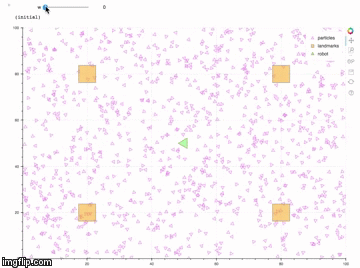

# A particle-filter visualization
- Particle Filter Visualization  in Python using [Bokeh](bokeh.pydata.org) based on [Udacity's free A.I. for Robotics course](https://www.udacity.com/course/artificial-intelligence-for-robotics--cs373)



- For visualization, if you check
[this jupyter notebook](./visualization_only.ipynb)
you'll see that you get the particle filter history by running the following:

```python
from particle_filter_prototype import *
robot_history, particles_history = run()
```
- This returns the robot instance and the list of particles at each timestep.
- You can access the position `[x, y, heading in radians]` by running
```python
x, y, heading = robot_history[t].get_current_position()
# t is the time in history
# returns a list of three float values
```
- Similarly you can access the position of a particle `[x, y, heading in radians]` by running
```python
x, y, heading = particles_history[t][i].get_current_position()
# t is the time in history
# i is the particle index
```
- See [the jupyter notebook](../docs/visualization_only.ipynb)
for more information
- Tune the global variables in ```lines 11-27``` in
[this file](./particle_filter_prototype.py)
to suit your needs

```python
Landmark = namedtuple('landmark', 'x y')
WORLD_SIZE = 100
LANDMARKS = [Landmark(x = 0.2 * WORLD_SIZE, y = 0.2 * WORLD_SIZE),
             Landmark(x = 0.2 * WORLD_SIZE, y = 0.8 * WORLD_SIZE),
             Landmark(x = 0.8 * WORLD_SIZE, y = 0.2 * WORLD_SIZE),
             Landmark(x = 0.8 * WORLD_SIZE, y = 0.8 * WORLD_SIZE)]

FORWARD_NOISE = 0.05
TURN_NOISE = 0.05
SENSE_NOISE = 5.

NUMBER_OF_PARTICLES = 1000
NUMBER_OF_STEPS = 15
FORWARD_DISTANCE = 2.
TURN_DISTANCE = pi / 6.

ROBOT_INITIAL_POSITION = [50., 50., pi / 2.]
```
- How the performance of the particle filter is evaluated at each time step at  ```line 58-69``` by getting the mean squared error
[this file](./particle_filter_prototype.py)
... edit as you see fit.
- The relative importance of the weights are computed in using the product of gaussian probabilities ```line 39-45```
[this file](./particle_filter_prototype.py)
... edit as you see fit.
- Resampling is done by using the cumulative normalized weights as seen in `line 150-180` of the function
`resample(particles, weights)` found in
[this file](./particle_filter_prototype.py)
... edit as you see fit.

---
### You can learn more about particle filters from the following links:
- https://github.com/rlabbe/Kalman-and-Bayesian-Filters-in-Python/blob/master/12-Particle-Filters.ipynb
- https://robotics.stackexchange.com/questions/479/particle-filters-how-to-do-resampling
